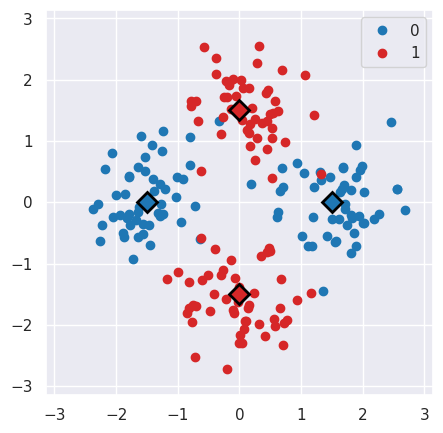
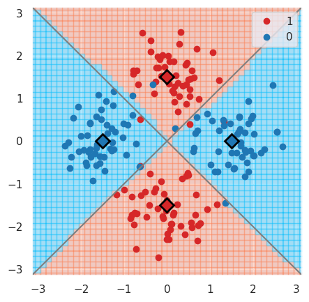

# Examples

## Example 1 : The XOR problem

Our first example is the XOR problem.
We dispose four points over the cartesian axes so to create a centered square; the two points on *x*-axis are labeled as 1, while those on *y*-axis as 0.

### Dataset generation

We use numpy to generate a dataset of 200 points by sampling 50 points from 4 gaussian distibutions centered at the said points.
The label of each sample is given by the center of its distribution.
```python
import numpy as np

n_pc = 50 # Number of points per cluster

# Create a matrix of vertices of the centered square
X = np.asarray(n_pc * [[1.5, 0.]] +
               n_pc * [[-1.5, 0.]] + 
               n_pc * [[0., -1.5]] + 
               n_pc * [[0., 1.5]]
)
# Add gaussian noise
X += .5 * np.random.randn(*X.shape)

# Create target vecor
y = np.concatenate((np.zeros(2*n_pc), np.ones(2*n_pc)))
```

This generates the following dataset, where the circles represent the samples and the squares the distribution centers.



### Circuit definition

Now, we define the circuit structure using a `circuitBulder`.
This function has to respect a precise signature: `make_circuit(bdr, x, params, shots=None)`. 
```python
def make_circuit(bdr, x, params, shots=None):
    bdr.allin(x[[0,1]])

    bdr.cz(0, 1)
    bdr.allin(params[[0,1]])

    bdr.cz(0, 1)
    bdr.allin(params[[2,3]])

    if shots: bdr.measure_all()
    return bdr.circuit()
```
Second last line add a measure gates only if a number of shots is provided. This prevents errors in case we want to use the satevector amplitudes for computations, as measuring the quantum state collapses the probabilities.

### Model training 

Finally, we can create and train the classifier. 
We instanciate the `circuitML` subclass that we prefer, in this case the one using the fast *manyq* simualtor, specifying the number of qubits and of parameters.

```python
from polyadicqml.manyq import mqCircuitML

nbqbits = 2
nbparams = 6

qc = mqCircuitML(make_circuit=make_circuit,
                nbqbits=nbqbits, nbparams=nbparams)
```

Then, we create and train the quantum classifer, specifying on which bitstrings we want to read the predicted classes.

```python
from polyadicqml import Classifier

bitstr = ['00', '01']

model = Classifier(qc, bitstr)
model.fit(X, y)
```

### Predict on new data

We can use a model to predict on some new datapoints `X_test` that it never saw before.
To obtain the bitstring probabilities, we can just call the model, by 

```python
pred_prob = model(X_test)
```

Then, we can retrieve the label of each point as the argmax of the corresponding probabilities.
Otherwise, we can combine the two operation by using the shorthand 

```python
y_pred = model.predict_label(X_test)
```

For instance, going back to our XOR problem, we can predict the label of each point on a grid that covers , to assess the model accuracy.
Using some list comprhension, it would look like this:

```python
t = np.linspace(-np.pi,np.pi, num = 50)
X_test = np.array([[t1, t2] for t1 in t for t2 in t])

y_pred = model.predict_label(X_test)
```

We can now plot the predictions and see that the model is very close to the bayesian prediction (whose decision boundaries are shown as grey lines), which is the best possible.



## Example 2: The Iris Flower dataset

For the second example, we perform teranry classification on the Iris Flower dataset.
In this case, we will train the model using a simulator and then test it on a real quantum computer, using IBMQ access.

### Data preparation

We load the dataset from scikit-learn and we split it in a train and a test set, representing respectively 60% and 40% of the samples.

```python
from sklearn import datasets
from sklearn.model_selection import train_test_split

iris = datasets.load_iris()
data = iris.data
target = iris.target

# Train-test split
input_train, input_test, target_train, target_test =\
    train_test_split(data, target, test_size=.4, train_size=.6, stratify=target)
```

Then, we center it and rescale it so that it has zero mean and all the feature values fall between  . (Actually, with our scaling, last interval should cover 99% of a gaussian with the same mean and std; it covers all points on almost all splits.)

```python 
import numpy as np

# NORMALIZATION
mean = input_train.mean(axis=0)
std = input_train.std(axis=0)

input_train = (input_train - mean) / std / 3 * 0.95 * np.pi
input_test = (input_test - mean) / std / 3 * 0.95 * np.pi
```

### Circuit definition

Now, we define a circuit on two qubits, again using the `make_circuit` syntax.

```python
def irisCircuit(bdr, x, params, shots=None):
    bdr.allin(x[[0,1]])
    bdr.cz(0, 1)

    bdr.allin(params[[0,1]])
    bdr.cz(0, 1)

    bdr.allin(x[[2,3]])
    bdr.cz(0, 1)

    bdr.allin(params[[2,3]])
    bdr.cz(0, 1)

    bdr.allin(x[[0,1]])
    bdr.cz(0, 1)

    bdr.allin(params[[4,5]])
    bdr.cz(0, 1)

    bdr.allin(x[[2,3]])
    bdr.cz(0, 1)

    bdr.allin(params[[6,7]])

    if shots: bdr.measure_all()

    return bdr.circuit()
```

Which corresponds to the following circuit:


### Model training

As in the previous example, we need a `circuitML` and a classifier, which we train with the corresponding dataset.

```python
from polyadicqml.manyq import mqCircuitML
from polyadicqml import Classifier

nbqbits = 2
nbparams = 8

qc = mqCircuitML(make_circuit=irisCircuit,
                 nbqbits=nbqbits, nbparams=nbparams)

bitstr = ['00', '01', '10']

model = Classifier(qc, bitstr).fit(input_train, target_train)
```

We can print the training scores.

```python
>>> pred_train = model.predict_label(input_train)
>>> print("Confusion matrix on train :",
>>>     confusion_matrix(target_train, pred_train),
>>>     "Accuracy : " + str(accuracy_score(target_train, pred_train)),
>>>     sep='\n')

Confusion matrix on train:
[[30  0  0]
 [ 0 30  0]
 [ 0  4 26]]
Accuracy : 0.9555555555555556
```

### Model Testing

Once the model is trained, we can test it.
Furthermore, we can keep the trained parameters and change the circuit backend, as long as the `make_circuit` function is the same.
So, if we have an [IBMQ account](https://qiskit.org/ibmqaccount/) configured and access to a quantum backend (in this case *ibmq-burlington*), we can run the test on an actual hardware.

We use the `Backend` utility class, along with the `qkCircuitML`, which implements `circuitML` for qiksit use.
**NOTE** that we must provide a number of shots, as the backend is not a simulator; the job size is inferred if left empty, but we chose to set it at 40.

```python
from polyadicqml.qiskit.utility import Backends
from polyadicqml.qiskit import qkCircuitML

backend = Backends("ibmq_burlington")

qc = qkCircuitML(backend=backend,
                 make_circuit=irisCircuit,
                 nbqbits=nbqbits, nbparams=nbparams)

model.set_circuit(qc)
model.nbshots = 300
model.job_size = 40

pred_test = model.predict_label(input_test)
```

Finally, we can print the test scores:

```python
>>> print("Confusion matrix on test :",
>>>     confusion_matrix(target_test, pred_test),
>>>     "Accuracy : " + str(accuracy_score(target_test, pred_test)),
>>>     sep='\n')

Confusion matrix on test:
[[20  0  0]
 [ 0 20  0]
 [ 0  0 20]]
Accuracy : 1.0
```

### Source code

The git page contains the source code that produced the results and the figures in this examples.
Note that the second experiment being run on a physical quantum computer, the test output is random, so it could slightly differ form the presented one - run on IBMq-burlington the 23rd June 2020. 

From the root directory, the examples can be run by command line as:

- Example 1 : `python3 exaples/example-XOR.py`
- Example 2 : `python3 exaples/example-iris.py`